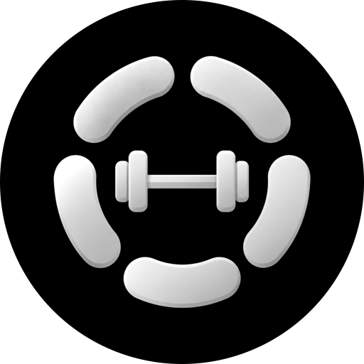
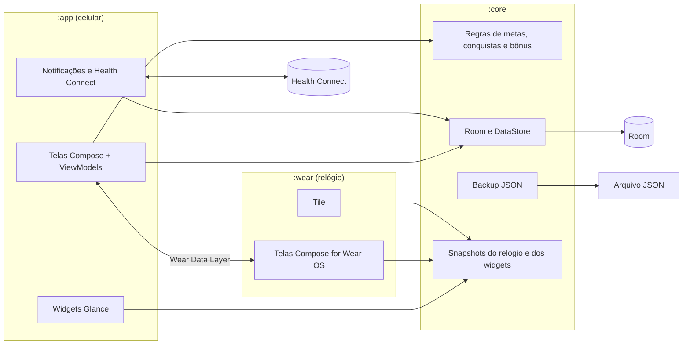
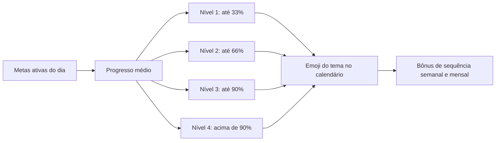

# &nbsp;&nbsp;Gym&nbsp;Nutshell&nbsp;&nbsp;

_Rastreie metas de nutrição, sono, suplementos e libere conquistas._

O Gym Nutshell nasceu da minha rotina de academia. Eu precisava lembrar de bater a meta de proteína, água, fibras e creatina, e ainda registrar cardio e sono, mas não achei nenhum app que fizesse tudo isso junto.

Durante o dia, você rastreia cada meta com sliders simples, incluindo calorias, carboidratos e gorduras, e recebe notificações durante o dia.

Para deixar o app um pouco mais divertido, cada dia completo vira uma conquista temática, com sequências e um calendário do seu progresso.

Tem as mesmas funções da [versão iOS](https://github.com/jonathaxs/gymnutshell-ios) e é gratuito, sem anúncios, sem assinatura e sem cadastro.

**Disponível em [APK](https://jonathasmotta.com/downloads/GymNutshell-1.0.apk)** para Android, com suporte para tablets e Wear OS.

## Funcionalidades - Versão 1.0 
_(Algumas funcionalidades estão sendo removidas e outras aprimoradas na futura Versão 1.1)_ 

**Hoje**
- Metas do dia com registro rápido e anel de progresso geral.
- Botão de dia de descanso, que conta a meta como cumprida nos dias de pausa.
- Metas nas categorias Essencial, Nutrição, Treino e Suplemento, com ordem personalizável.

**Metas**
- Metas prontas: musculação, cardio, sono, água, calorias, proteína, carboidrato, gordura boa, fibra e creatina.
- Valores recomendados calculados a partir do peso, altura, idade, sexo e objetivo, com calorias pela fórmula de Mifflin-St Jeor.
- Metas e categorias personalizadas criadas pelo usuário.
- Unidades no sistema métrico ou imperial.

**Conquistas e temas**
- Quatro níveis de conquista por dia, conforme o progresso médio das metas.
- 19 temas em seis categorias (esporte, animais, lutadores, elementos, espaço e competição), cada um com seus emojis e nomes de nível, incluindo variações no feminino.
- Calendário mensal de conquistas, com histórico editável.
- Bônus de sequência semanais e mensais para quem mantém os níveis mais altos todos os dias.

**Progresso**
- Dias registrados, pontos e bônus acumulados.
- Quantidade de dias em cada nível e resumo das metas e dos dados físicos.

**Wear OS**
- App próprio em três páginas: progresso do dia, estatísticas e notificações.
- Sincronização nos dois sentidos com o celular.
- Tile com o progresso do dia.

**Widgets**
- Progresso, Calendário e Metas, com fundo configurável.

**Health Connect**
- Leitura dos treinos para marcar musculação e cardio automaticamente.
- Registro das horas de sono.
- Permissões pedidas sob demanda, só para o que o usuário ativar.

**Lembretes**
- Notificações locais por meta, com intervalo configurável e horário limitado ao período do dia.
- Histórico das notificações recebidas.

**Dados e personalização**
- Backup em JSON para exportar e importar, compatível com a versão iOS.
- Backup automático do sistema Android.
- Cores de destaque configuráveis e bloqueio de orientação da tela.
- Interface em Português do Brasil e English, com troca de idioma dentro do app.
- Suporte a TalkBack, modo claro e modo escuro.
- Layout adaptado a telas largas, com navegação lateral em tablets e celulares na horizontal.

## Arquitetura



- **Kotlin** e **Jetpack Compose** com **Material 3** em toda a interface, no padrão **MVVM**: cada tela tem sua ViewModel, e o estado flui por `StateFlow`.
- **Três módulos Gradle**:
  - `:core` tem domínio e persistência, sem interface;
  - `:app` é o app do celular, com os widgets;
  - `:wear` é o app do relógio.
- Toda regra que pode ser testada sem interface fica no `:core`. Assim o relógio e os widgets reaproveitam a mesma lógica.
- **Room** para os registros diários e as metas personalizadas; **DataStore** para as preferências. As chaves são as mesmas do iOS, o que mantém o backup compatível entre as plataformas.
- **kotlinx.serialization** para o backup e a sincronização com o relógio.
- **WorkManager** para os lembretes, **Glance** para os widgets, **Health Connect** para a integração com a saúde e **Wear Data Layer** para a sincronização com o relógio.
- Testes unitários com JUnit, concentrados no `:core`, e testes instrumentados de acessibilidade com o Compose.

### Do check-in à conquista



## Estrutura do repositório

```text
GymNutshell/
├── core/                      Domínio e persistência, sem interface
│   └── src/main/java/.../core/
│       ├── domain/            Metas, cálculo das metas, conquistas, temas e bônus
│       ├── data/              Banco Room, DAOs e repositórios sobre DataStore
│       ├── backup/            Formato e leitura do backup JSON
│       ├── sync/              Snapshot enviado ao relógio
│       ├── theme/             Cores de destaque
│       └── widget/            Snapshot e fundo dos widgets
├── app/                       App do celular
│   └── src/main/java/.../
│       ├── ui/                Telas por área: Hoje, Conquistas, Progresso, Ajustes e boas-vindas
│       ├── widget/            Widgets Glance
│       ├── notifications/     Lembretes com WorkManager
│       ├── health/            Integração com o Health Connect
│       └── wear/              Sincronização com o relógio
├── wear/                      App Wear OS, com Tile
└── gradle/libs.versions.toml  Versões centralizadas das dependências
```

## Requisitos

- Android 10 (API 29) ou superior no celular.
- Wear OS 3 (API 30) ou superior no relógio.
- Android Studio com o Android Gradle Plugin 9 e o Kotlin 2.2.

Para compilar pelo terminal, use o JDK que vem com o Android Studio:

```bash
cd GymNutshell
export JAVA_HOME="/Applications/Android Studio.app/Contents/jbr/Contents/Home"
./gradlew :app:assembleDebug
./gradlew :core:testDebugUnitTest
```

## Instalação

Por enquanto o app não está na Google Play. A versão 1.0 é distribuída como APK assinado, para instalação direta no aparelho: [baixar o GymNutshell-1.0.apk](https://jonathasmotta.com/downloads/GymNutshell-1.0.apk).

## Privacidade

O Gym Nutshell não exige cadastro e não coleta dados. As informações ficam no próprio aparelho e no backup do sistema Android do usuário. Os dados de saúde ficam no Health Connect e só são lidos ou gravados com a permissão do usuário. Não há servidores próprios, ferramentas de análise ou anúncios.

## Autor

Desenvolvido por **Jonathas Motta** ([@jonathaxs](https://github.com/jonathaxs)).
